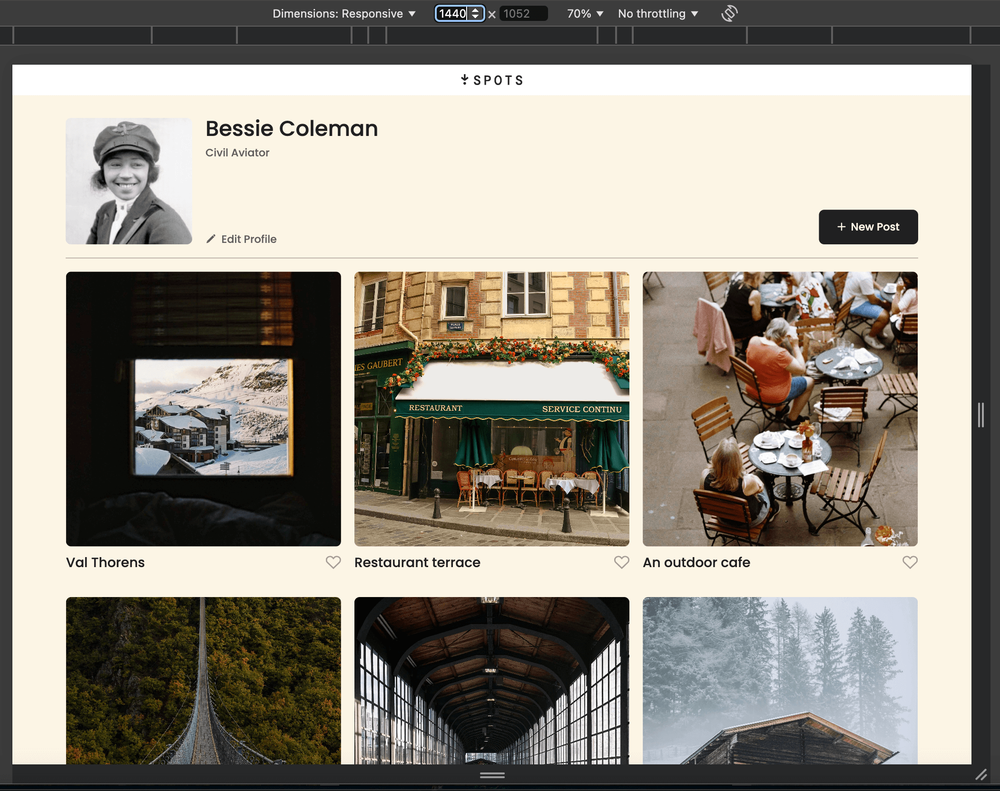
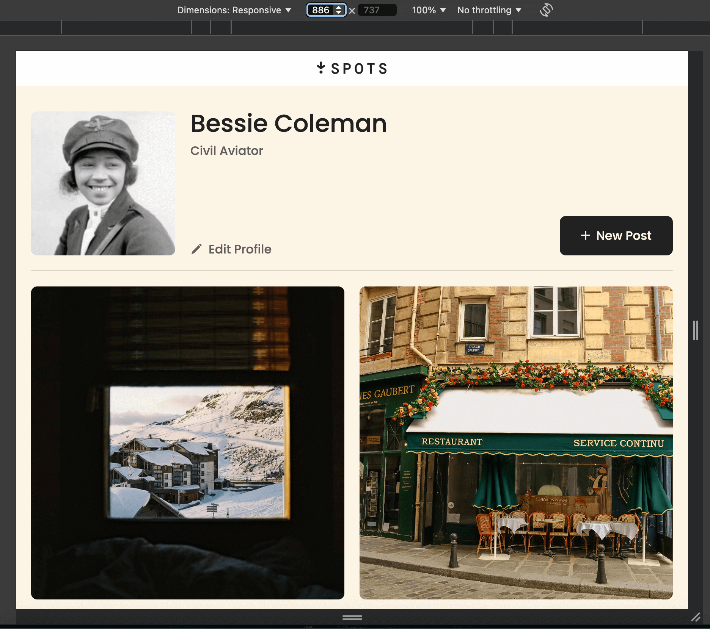
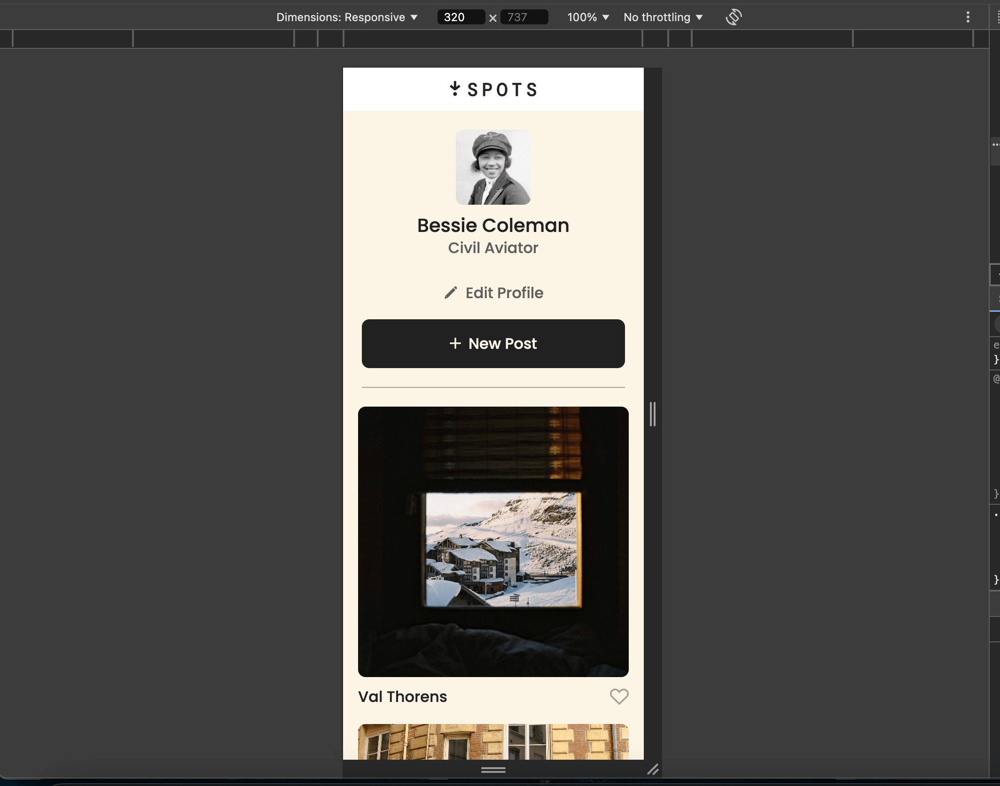

# Spots

An image sharing site.

This is the third project of the Software Engineering program at TripleTen. It was created using HTML and CSS, and was designed to be responsive using flexbox, grid, and media queries. The project is based on the following Figma design file.

**Figma**

- [Link to the project on Figma](https://www.figma.com/file/BBNm2bC3lj8QQMHlnqRsga/Sprint-3-Project-%E2%80%94-Spots?type=design&node-id=2%3A60&mode=design&t=afgNFybdorZO6cQo-1)

## Project features

- Semantic HTML5
- CSS
- Flexbox
- Grid
- Media queries for mobile
- Text overflow
- Flat BEM file structure
- CSS transition animations (for buttons)

**Images**

## Deployment

This webpage is deployed to GitHub pages.

- [Deployment link](https://elumiakelso.github.io/se_project_spots/)
